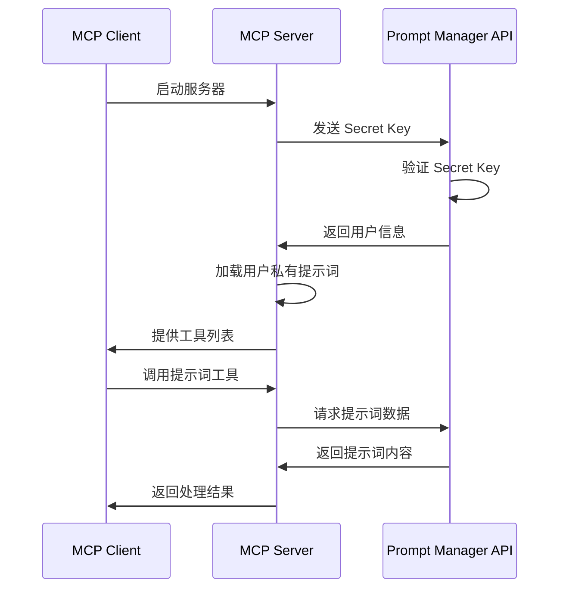

# Secret Key 认证系统使用指南

## 🎯 概述

Secret Key 认证系统为 MCP 服务器提供了安全、便捷的用户认证方式，无需暴露用户名密码，支持获取用户私有提示词。

## ✨ 主要优势

### 🔒 安全性提升
- **无需暴露密码**：使用随机生成的64位密钥
- **支持撤销**：可随时刷新密钥，使旧密钥失效
- **自动过期跟踪**：记录使用时间，便于监控

### 🚀 功能增强
- **私有提示词访问**：获取用户专属的提示词库
- **统一认证**：支持多种MCP客户端使用同一密钥
- **缓存优化**：Redis缓存提升认证性能

## 📋 功能对比

| 认证方式 | 安全性 | 便捷性 | 功能支持 | 管理性 |
|---------|-------|-------|----------|--------|
| **用户名密码** | ⚠️ 中等 | ❌ 需要输入 | ❌ 仅公共提示词 | ❌ 难以撤销 |
| **Secret Key** | ✅ 高 | ✅ 配置一次 | ✅ 私有+公共提示词 | ✅ 可随时刷新 |

## 🛠️ 快速开始

### 1. 获取您的 Secret Key

#### 方法一：通过网页界面
1. 登录 AI咖 网站：`https://www.aiprompter.cc`
2. 点击右上角用户菜单
3. 选择 "Secret Key"
4. 查看或刷新您的密钥

#### 方法二：通过 API 接口
```bash
# 使用 JWT Token 获取 Secret Key
curl -X GET "https://www.aiprompter.cc/api/user/secret-key" \
  -H "Authorization: Bearer YOUR_JWT_TOKEN"

# 刷新 Secret Key
curl -X POST "https://www.aiprompter.cc/api/user/secret-key" \
  -H "Authorization: Bearer YOUR_JWT_TOKEN"
```

### 2. 配置 MCP 服务器

#### 环境变量配置
创建 `.env` 文件：
```bash
# API 服务地址
PROMPT_MANAGER_API_URL=https://www.aiprompter.cc

# 您的 Secret Key
SECRET_KEY=your_64_character_secret_key_here

# 工具数量限制（可选，默认25）
MAX_PROMPT_TOOLS=25

# 调试模式（可选）
NODE_ENV=development
```

#### Cursor MCP 配置
编辑 `~/.cursor/mcp_config.json`：
```json
{
  "mcpServers": {
    "prompt-manager": {
      "command": "node",
      "args": ["path/to/mcp-prompt-server/src/index-api.js"],
      "env": {
        "PROMPT_MANAGER_API_URL": "https://www.aiprompter.cc",
        "SECRET_KEY": "your_64_character_secret_key_here",
        "MAX_PROMPT_TOOLS": "25"
      }
    }
  }
}
```

### 3. 启动服务

```bash
# 进入 MCP 服务器目录
cd mcp-prompt-server

# 安装依赖
npm install

# 启动服务器
node src/index-api.js
```

## 🔧 API 接口文档

### 获取 Secret Key
```http
GET /api/user/secret-key
Authorization: Bearer {jwt_token}
```

**响应示例：**
```json
{
  "success": true,
  "data": {
    "secret_key": "b05b45d2ae989c8b09cf1a1fcb7e0f6d512f9f753ba0d6fd767d388713c1e876",
    "created_at": "2025-07-06T07:27:17.301Z",
    "last_used": null,
    "usage_info": "此Secret Key可用于MCP服务器认证，无需用户名密码"
  }
}
```

### 刷新 Secret Key
```http
POST /api/user/secret-key
Authorization: Bearer {jwt_token}
```

**响应示例：**
```json
{
  "success": true,
  "message": "Secret Key刷新成功",
  "data": {
    "secret_key": "170904fb3cd0ee1c141bd039a77ff598b456fe22b5f90267792eec399b09fa21",
    "created_at": "2025-07-06T15:30:55.127Z",
    "last_used": null,
    "notice": "请更新您的MCP配置中的SECRET_KEY"
  }
}
```

### 验证 Secret Key
```http
PUT /api/user/secret-key
X-Secret-Key: {secret_key}
```

**响应示例：**
```json
{
  "success": true,
  "message": "Secret Key验证成功",
  "user": {
    "id": 1,
    "username": "AA",
    "email": null
  }
}
```

## 📊 MCP 服务器功能

### 支持的工具类型

#### 1. 用户私有提示词
- 🔒 **需要认证**：只有通过 Secret Key 认证的用户可访问
- 📝 **完整权限**：查看、编辑、删除自己的提示词
- 🔄 **实时同步**：与网站数据实时同步

#### 2. 公共提示词
- 🌐 **无需认证**：所有用户都可访问
- 👀 **只读权限**：可查看和使用，但不能修改
- 🔥 **热度排序**：按热度和使用量排序

#### 3. 管理工具
- `reload_prompts` - 重新加载提示词数据
- `get_prompt_names` - 获取所有可用提示词名称
- `get_all_categories` - 获取所有分类
- `search_prompts` - 搜索提示词
- `get_prompt_info` - 获取提示词详细信息

### 认证流程



## 🔐 安全最佳实践

### 1. Secret Key 管理
- ✅ **定期轮换**：建议每3-6个月刷新一次
- ✅ **安全存储**：不要在代码中硬编码，使用环境变量
- ✅ **访问控制**：不要分享给他人
- ✅ **监控使用**：定期检查使用记录

### 2. 环境隔离
```bash
# 开发环境
SECRET_KEY=dev_secret_key_here
PROMPT_MANAGER_API_URL=http://localhost:3001

# 生产环境
SECRET_KEY=prod_secret_key_here
PROMPT_MANAGER_API_URL=https://www.aiprompter.cc
```

### 3. 权限控制
- 🔒 **最小权限原则**：只请求必要的提示词数量
- 🔍 **使用监控**：通过网站查看 Secret Key 使用记录
- ⚡ **即时撤销**：如发现异常立即刷新密钥

## 🐛 故障排除

### 常见问题

#### 1. "无效的Secret Key"
**原因：** Secret Key 已过期或输入错误  
**解决：** 重新获取或刷新 Secret Key

#### 2. "连接超时"
**原因：** 网络问题或服务器地址错误  
**解决：** 检查 `PROMPT_MANAGER_API_URL` 配置

#### 3. "工具加载失败"
**原因：** 认证失败或权限不足  
**解决：** 验证 Secret Key 是否正确配置

### 调试命令

```bash
# 测试 Secret Key 是否有效
curl -X PUT "https://www.aiprompter.cc/api/user/secret-key" \
  -H "X-Secret-Key: YOUR_SECRET_KEY"

# 检查 MCP 服务器日志
NODE_ENV=development node src/index-api.js

# 验证环境变量
echo $SECRET_KEY
echo $PROMPT_MANAGER_API_URL
```

## 📈 性能优化

### 1. 缓存策略
- **用户认证缓存**：5分钟
- **提示词数据缓存**：10分钟
- **公共内容缓存**：30分钟

### 2. 工具数量控制
```bash
# 根据使用需求调整工具数量
MAX_PROMPT_TOOLS=15  # 轻量使用
MAX_PROMPT_TOOLS=25  # 正常使用（推荐）
MAX_PROMPT_TOOLS=40  # 重度使用（最大值）
```

### 3. 网络优化
- 使用地理位置较近的服务器
- 配置适当的连接超时时间
- 启用 HTTP/2 和压缩

## 🆕 版本更新日志

### v3.0.0 (2025-07-06)
- ✨ 新增 Secret Key 认证系统
- 🔒 支持用户私有提示词访问
- ⚡ Redis 缓存性能优化
- 🛠️ 完整的 API 文档和使用指南

### 升级说明
1. 执行数据库迁移：`scripts/add-secret-key-field-compatible.sql`
2. 更新 MCP 服务器代码
3. 配置 Secret Key 环境变量
4. 重启服务

## 📞 支持与反馈

- 🌐 **官网**：https://www.aiprompter.cc
- 📧 **邮箱**：support@aiprompter.cc
- 💬 **微信群**：扫描网站二维码加入
- 🐛 **问题反馈**：通过网站联系我们

---

> 💡 **提示**：Secret Key 认证系统让您的 MCP 服务器更安全、更强大。立即体验私有提示词的便利！ 